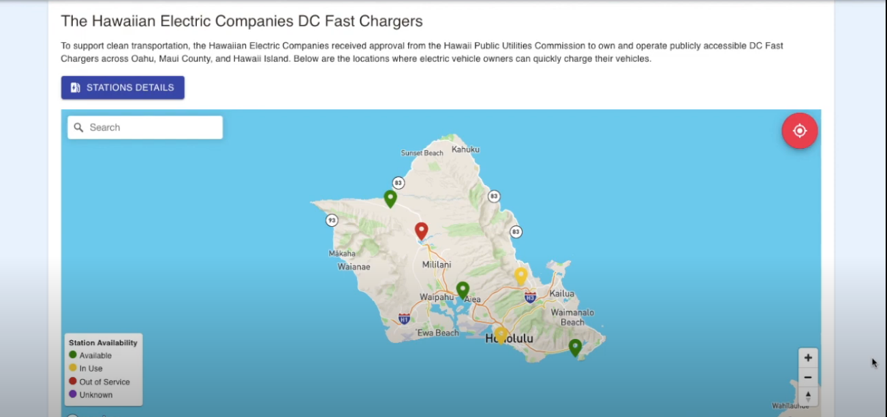

HACC Overflow was the team I participated with in the 2019 Hawaii Annual Coding Challenge. With three others I helped develop a web application to help Hawaiian Electric track charging data for Electric Vehicles. Two of my teamates were primarily focused on the backend with Python / Flask, while I and one other were focused on a user facing web app with React / JS, to help users find and check the status of local charging stations. 
This was a great opportunity to gain experience working in a team and under a strict deadline. I also gained experience working with Slack and Github in a group setting.

HACC Overflow Repo: https://github.com/HACC2019/hacc-overflow

Devpost: https://devpost.com/software/ev-charge-analysis
