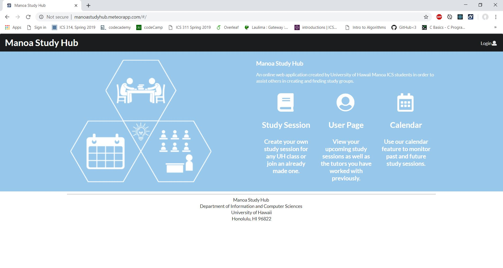

Manoa Study Hub is a web application designed to connect students at the University of Hawaii at Manoa. The application allows users to create accounts, create study sessions, add study sessions and view users with similar interests. In the account creation phase, the user can add their first and last name, major, up to three subjects, an image and a description. They can then log in with their email and password. In the create study session phase, the user can add the subject, course number, date and location.

The website was built using HTML, CSS, Javascript, React and Meteor. My group used Github for version control and the built in issues and task management system to keep track of who was in charge of what. The project was split into three milestones. The first covered developing the concept and developing mockup pages. The second covered adding in basic functionality and routing throughout the website. The third and final milestone was mostly cleanup and adding final functionality. We deployed the website using Atlas and Meteor Galaxy hosting. My tasks mostly covered the User Homepage, the signup sheet and the admin functionality. 

This project was a great opportunity to work in a team setting, use version control software and practice the skills I learned in ICS 314. It was very interesting to see how independent coding is then assembled into a working project. It was also interesting to practice planning a large scale project in a group setting. There certainly were issues working with a group but overall we were able to resolve them and develop a working product. 
Manoa Study Hub: https://manoastudyhub.github.io/
