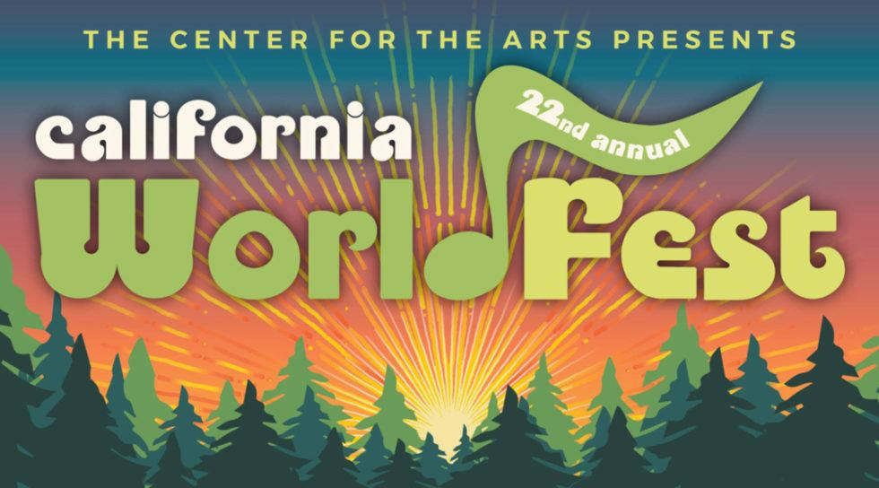

Worldfest is an international music festival presented by the Center for the Arts in Nevada County. The festival brings together dozens of artists, musicans and performers from various ethnicities and backgrounds. At the time that I volunteered the performers included sitarist Anoushka Shankar, indie folk band Magic Giant and funk band Galactic. Previous guests for the festival have also included Michael Franti and Boz Scaggs. In addition to music, the festival hosts a variety of local vendors selling clothing, art and body care products from all across the world. 
During the summer of 2018 my girlfriend and I took the opportunity to volunteer at the festival. We worked both at the front ticket office handing out wristbands and in the campground selling ice to the campers. As volunteers we had free access to the festival for the days we worked. 

